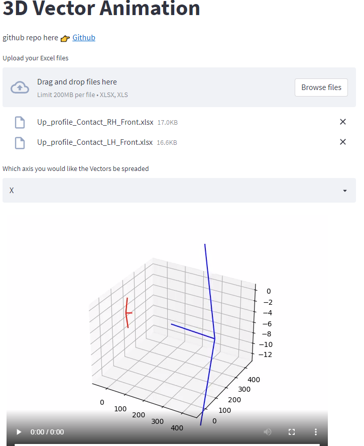

# Vector Animation

## Installation

```
conda create --name aio python=3.7
```

```
conda activate aio
```

```python
pip install -r requirements.txt
```
```
conda install -c conda-forge ffmpeg
```


## Run Streamlit app

```python
streamlit run vector_visualization/app.py
```


## Demo Page

